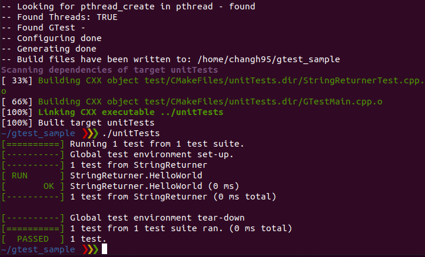

# gtest_sample

This repository contains a very simple example to use GTest

## How to use

- Open a terminal
- Type `sh install_gtest.sh` to run the script to install GTest
   - GTest will be installed inside 'thirdparty' folder.
- Type `cmake . && make -j` to build the project
- Type `./unitTests` to run the unit test

## Explanation

Inside the 'src' folder, you will find a file called 'StringReturner.hpp'.
This file contains a simple class called `StringReturner`, which has two public functions: `getHello()` and `getWorld`.
Each function returns a string `"hello"` and `"world"`.

Inside the 'test' folder, you will find a file called 'StringReturerTest.cpp'.
This file contains a test function to test if `getHello()` returns `"hello"` and `getWorld()` returns `"world"` as intended, using GTest.

## Results

The test successfully passed.

